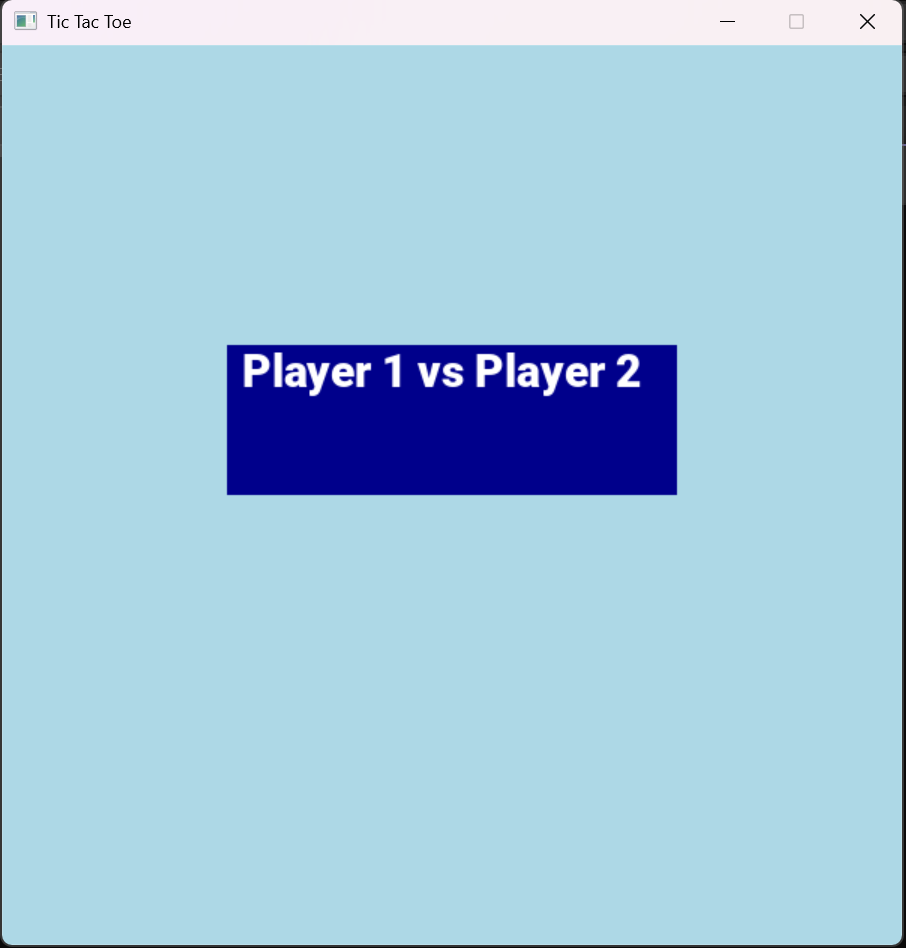
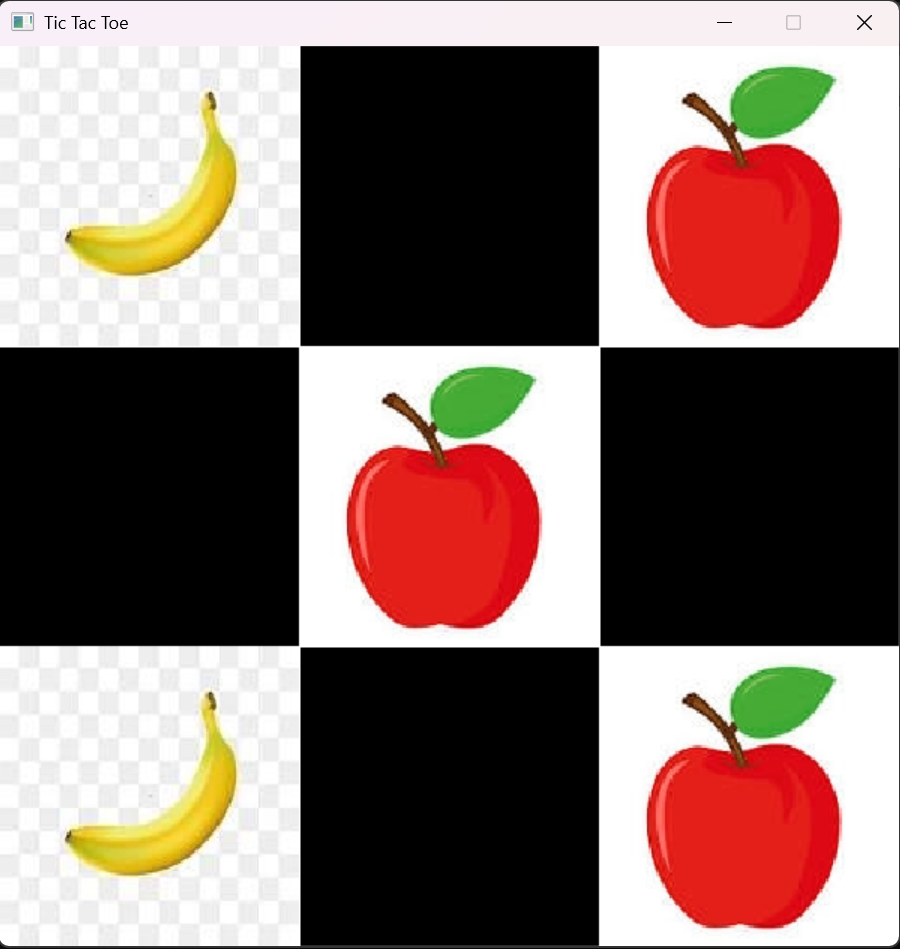
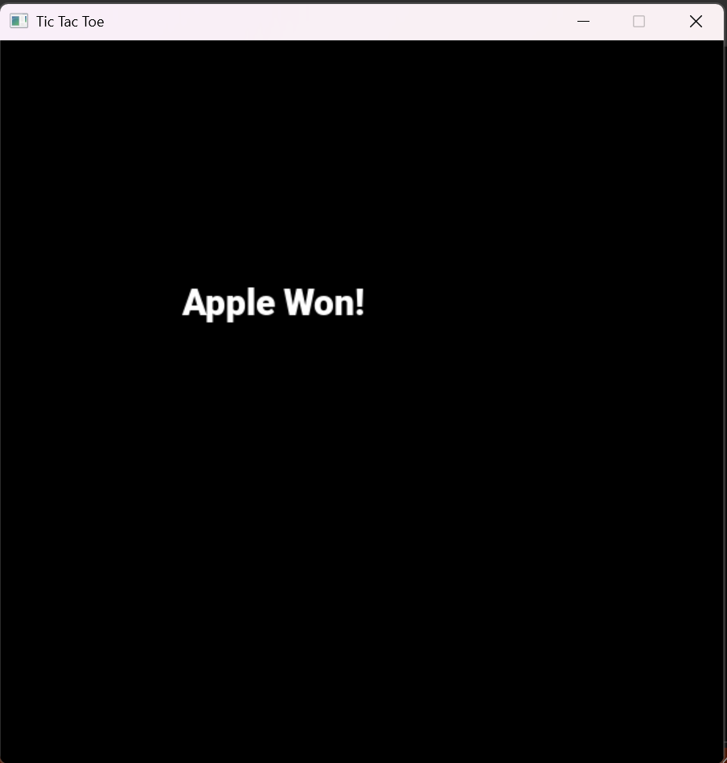

# Tic Tac Toe Game 🎮  (C++ | SDL)

An interactive Tic Tac Toe game built using C++. The game features a custom Apple vs Banana theme, smooth animations, and simple mouse-driven gameplay.

This project was developed as a learning exercise to practice basic game development concepts, event handling, and structured programming in C++.

## Features

- Apple vs Banana themed gameplay
- Player vs Player mode
- Mouse-based input system
- Simple animations for moves
- Win and draw detection

## Technologies Used

- C++
- SDL (Simple DirectMedia Layer)
- SDL_image
- SDL_ttf

## Screenshots
### Main Menu

### Game While playing

### Result Screen

## How to Run

1. Open project in Visual Studio
2. Ensure SDL libraries are properly configured
3. Build and run the project

##  Learning Purpose

This project helped me understand:
- Basic game loop structure
- Event-driven programming
- C++ structuring and logic design

## Future Improvements

- Add AI opponent
- Add sound effects
- Improve UI design
- Add restart and scoring system

